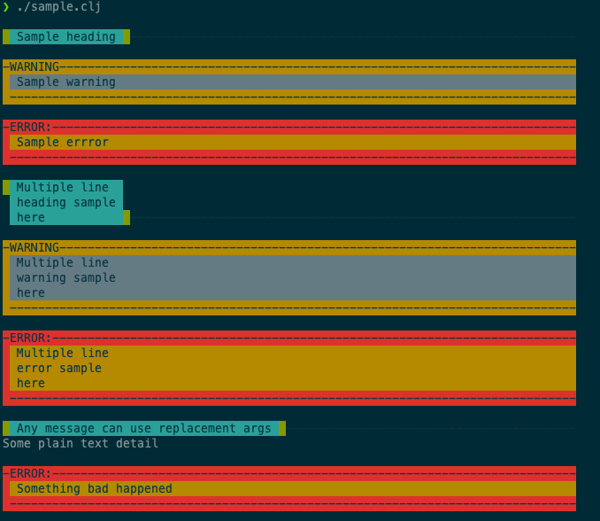

= Status Line

== Status

Alpha, initial release.

== Rationale
When I run scripts, it helps my old eyeballs when certain output lines are colourized.
It also helps if this colourization is CI friendly.

My choice of colors and formatting might not be your cup of tea.
I'm not terribly offended.

Why a library for something so simple?
I found myself copying and pasting my status line helper into various projects and didn't like doing that.

== Usage
We currently support four types of status lines:

* `:head` - Separates and describes output to follow
* `:warn` - Draws my eye to something that is not fatal but worthy of attention
* `:error` - Draws my eye to something more serious, maybe fatal
* `:detail` - Currently just plain text - I typically use println for debugging; using this instead reminds me output is deliberate

Add status-line to your `deps.edn` or `bb.edn` via `:git/url`.

=== Example Run

When I run the following script from my terminal:
[source,clojure]
----
#!/usr/bin/env bb
(require '[lread.status-line :as status])

(status/line :head "Sample heading")
(status/line :warn "Sample warning")
(status/line :error "Sample errror")

(status/line :head "Multiple line\nheading sample\nhere")
(status/line :warn "Multiple line\nwarning sample\nhere")
(status/line :error "Multiple line\nerror sample\nhere")

(status/line :head "Any %s can use %s args" "message" "replacement")

(status/line :detail "Some plain text detail")

(status/die 1 "Something %s happened" "bad")
----

I see the following output:

Your result may look a bit different depending on what colour schemes/themes you have configured in your terminal.

== License
Copyright © 2021 Lee Read, all rights reserved.

Distributed under the Eclipse Public License, see LICENSE.
